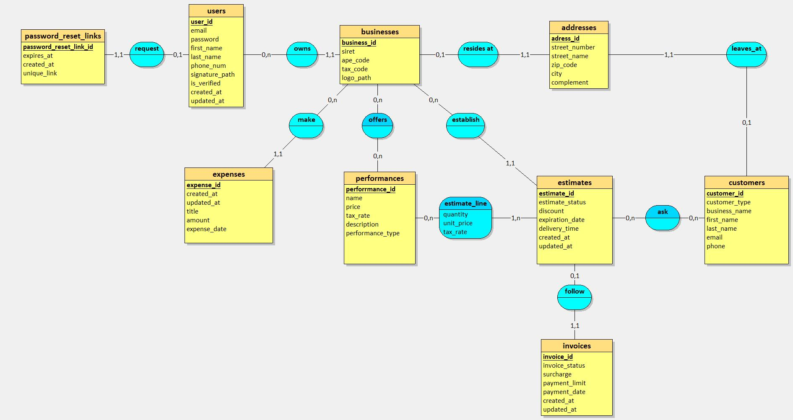
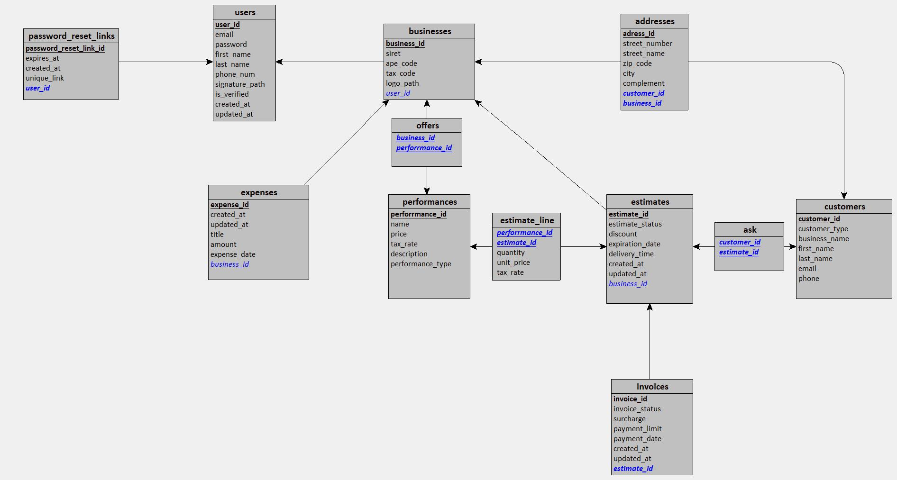
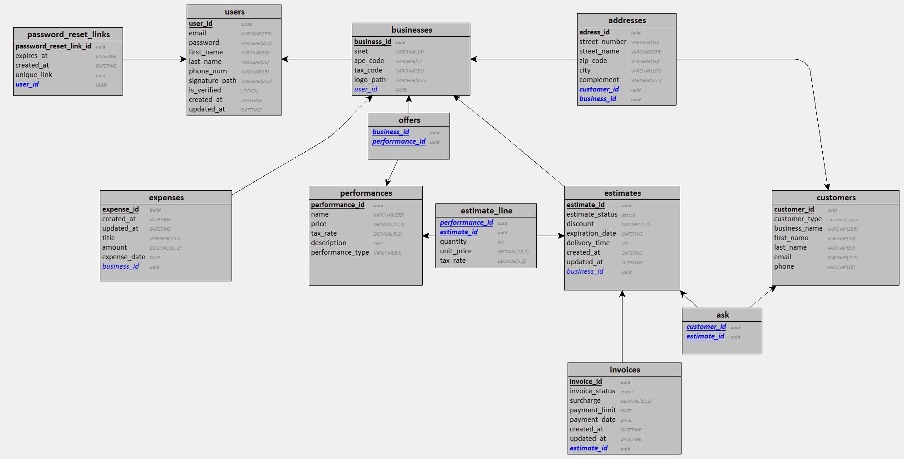

# Modélisation Merise

## Modèle Conceptuel de Données (MCD)

Le MCD représente la structure logique des données, indépendamment des contraintes techniques.

## Modèle Logique de Données (MLD)

Le MLD est la traduction du MCD en tenant compte des contraintes techniques de la base de données relationnelle.

## Modèle Physique de Données (MPD)

Le MPD est l'implémentation concrète du MLD pour notre SGBD PostgreSQL.

## Source

Le fichier source `pigeon-devis-2.loo` a été créé avec l'outil [Looping](http://www.looping-mcd.fr/), un outil de modélisation Merise. 