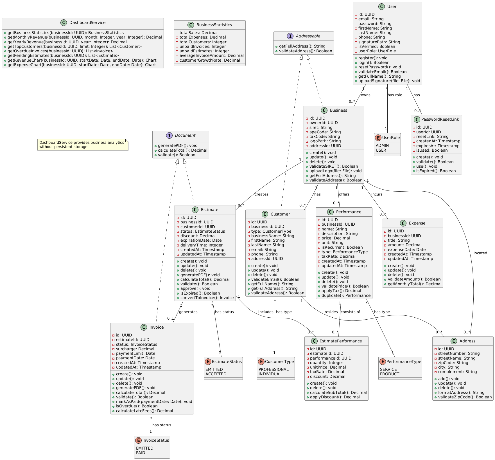
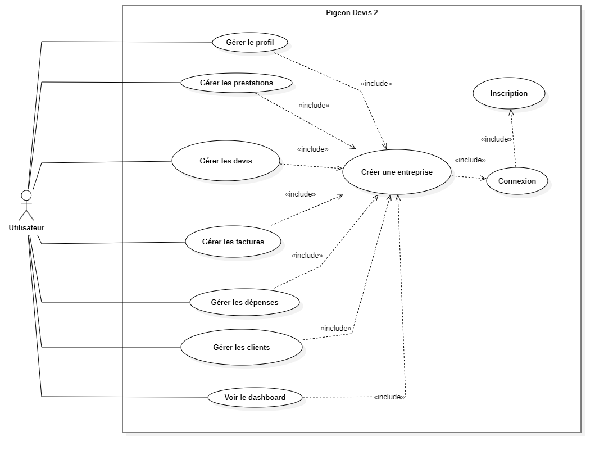
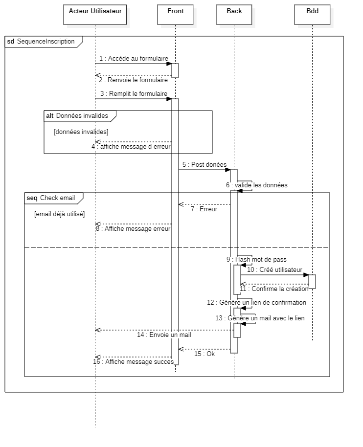
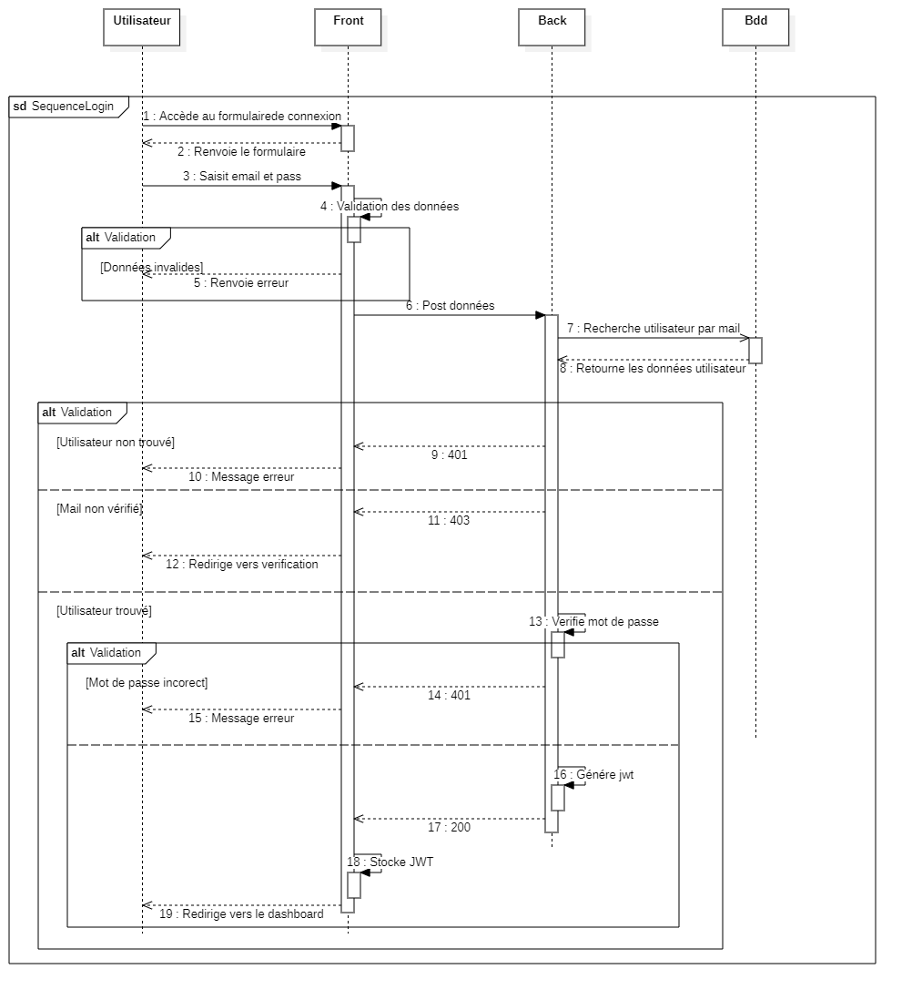

# Diagrammes UML

## Diagramme de Classes
Représente la structure du système de gestion de devis, avec les entités principales pour gérer les utilisateurs, entreprises, clients, devis et factures. Le tableau de bord est implémenté comme un service sans stockage.

## Diagramme de Cas d'Utilisation
Montre les fonctionnalités accessibles aux utilisateurs de Pigeon Devis, avec une séparation claire entre la gestion de compte, la gestion administrative et la gestion commerciale.

## Diagrammes de Séquence

### Inscription
Processus d'inscription avec validation des données et création du compte utilisateur. L'email doit être unique dans le système.

### Connexion
Authentification de l'utilisateur avec génération d'un JWT pour les requêtes futures. Vérifie aussi que le compte est bien validé.

### Création d'Entreprise
Création d'une entreprise avec validation basique du SIRET (format 14 chiffres). Nécessite une authentification valide.

